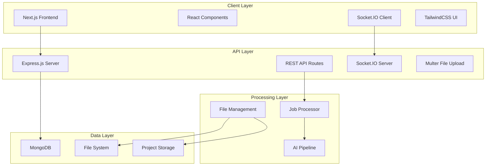

# Design Document

## Overview

The AI-powered multilingual dubbing and subtitling system is designed as a full-stack web application that provides professional video editing tools for sound engineers and dubbing teams. The system features a modern React-based frontend with real-time WebSocket communication to a Node.js backend that orchestrates an AI processing pipeline for automated dubbing across multiple languages.

The architecture follows a monorepo structure with clear separation between client and server components, utilizing modern web technologies to deliver a responsive, professional-grade user experience similar to industry-standard video editing software.

## Architecture

### High-Level System Architecture



### Technology Stack

**Frontend Stack:**
- Next.js 15 with App Router for modern React development
- TypeScript for type safety and developer experience
- TailwindCSS 4 for utility-first styling with dark theme support
- ShadCN/UI components with Radix primitives for accessibility
- Framer Motion for smooth animations and transitions
- Socket.IO Client for real-time communication
- React Dropzone for enhanced file upload experience

**Backend Stack:**
- Express.js as the web framework with TypeScript support
- Socket.IO for WebSocket-based real-time communication
- Multer for secure multipart file upload handling
- MongoDB with Mongoose for data persistence
- fs-extra for enhanced file system operations
- Helmet and CORS for security and cross-origin support

**Development Tools:**
- Concurrently for parallel development server execution
- Nodemon for automatic server restart during development
- ESLint for code quality and consistency
- PostCSS for CSS processing pipeline

## Components and Interfaces

### Frontend Components

#### Core Layout Components
- **AppLayout**: Root layout with theme provider, font configuration, and global styles
- **Header**: Navigation bar with project search, filters, theme toggle, and user actions
- **Sidebar**: Project navigation and quick access to frequently used features
- **Footer**: Status information and system health indicators

#### Project Management Components
- **Dashboard**: Grid/list view of projects with statistics and filtering capabilities
- **ProjectCard**: Individual project display with progress indicators and metadata
- **ProjectCreation**: Multi-step project creation wizard with file upload
- **ProjectSettings**: Configuration panel for project-specific settings

#### File Upload Components
- **DropZone**: Drag-and-drop interface with visual feedback and validation
- **FileUploadProgress**: Real-time upload progress with cancel functionality
- **FilePreview**: Thumbnail and metadata display for uploaded files
- **FileValidation**: Client-side validation with error messaging

#### Real-time Processing Components
- **ProgressTracker**: WebSocket-connected progress display with step breakdown
- **JobStatusIndicator**: Visual status representation with color coding
- **ProcessingTimeline**: Step-by-step pipeline visualization
- **ErrorHandler**: User-friendly error display with retry options

#### Results and Export Components
- **ResultsViewer**: Preview interface for generated content
- **DownloadManager**: Organized download interface by language and file type
- **VideoPlayer**: Custom video player with subtitle overlay support
- **ExportOptions**: Configuration panel for output formats and quality settings

### Backend API Interfaces

#### REST API Endpoints

```typescript
// Project Management
POST   /api/projects              // Create new project
GET    /api/projects              // List all projects
GET    /api/projects/:id          // Get project details
PUT    /api/projects/:id          // Update project
DELETE /api/projects/:id          // Delete project

// File Upload
POST   /api/upload                // Upload scene clips and actor audio
GET    /uploads/:filename         // Serve uploaded files
GET    /projects/:id/files        // List project files

// Job Processing
POST   /api/job/start             // Start dubbing job
GET    /api/jobs/:id              // Get job status
DELETE /api/jobs/:id              // Cancel job
GET    /api/results/:jobId        // Get completed results

// System
GET    /health                    // Health check endpoint
GET    /api/stats                 // System statistics
```

#### WebSocket Events

```typescript
// Client to Server Events
interface ClientEvents {
  'subscribe': (jobId: string) => void;
  'unsubscribe': (jobId: string) => void;
  'join-project': (projectId: string) => void;
  'leave-project': (projectId: string) => void;
}

// Server to Client Events
interface ServerEvents {
  'progress': (data: JobProgressData) => void;
  'complete': (data: JobCompleteData) => void;
  'error': (data: JobErrorData) => void;
  'project-update': (data: ProjectUpdateData) => void;
}
```

### Data Models

#### Project Model
```typescript
interface Project {
  id: string;
  title: string;
  description?: string;
  director: string;
  status: 'draft' | 'in-progress' | 'completed' | 'processing';
  sceneClip: {
    filename: string;
    originalName: string;
    path: string;
    size: number;
    duration?: number;
  };
  actorAudio: Array<{
    id: number;
    filename: string;
    originalName: string;
    path: string;
    size: number;
  }>;
  targetLanguages: string[];
  voiceMapping?: Record<string, string>;
  createdAt: Date;
  updatedAt: Date;
}
```

#### Job Model
```typescript
interface Job {
  id: string;
  projectId: string;
  targetLanguages: string[];
  voiceMapping: Record<string, any>;
  status: 'queued' | 'processing' | 'completed' | 'failed';
  progress: number;
  steps: Array<{
    step: string;
    message: string;
    timestamp: Date;
    progress: number;
    duration?: number;
  }>;
  createdAt: Date;
  startedAt?: Date;
  completedAt?: Date;
  errorMessage?: string;
}
```

#### Processing Pipeline Steps
```typescript
interface ProcessingStep {
  name: 'transcription' | 'translation' | 'voice_cloning' | 'tts' | 'mixing' | 'output';
  description: string;
  progressRange: [number, number];
  estimatedDuration: number;
  dependencies: string[];
}
```

## Data Models

### File Storage Structure

```
project-root/
├── uploads/                    # Temporary upload storage
│   └── [unique-filename]
├── projects/                   # Organized by project ID
│   └── [project-id]/
│       ├── scene.mp4          # Main scene clip
│       ├── actor_1.wav        # Actor audio files
│       ├── actor_2.wav
│       └── metadata.json      # Project metadata
└── outputs/                   # Results by language
    ├── en/
    │   ├── clips/
    │   │   └── [project-id].mp4
    │   └── subtitles/
    │       └── [project-id].srt
    └── [language]/
        ├── clips/
        └── subtitles/
```

### Database Schema

#### Projects Collection
```javascript
{
  _id: ObjectId,
  title: String,
  description: String,
  director: String,
  status: String,
  sceneClip: {
    filename: String,
    originalName: String,
    path: String,
    size: Number,
    duration: Number
  },
  actorAudio: [{
    id: Number,
    filename: String,
    originalName: String,
    path: String,
    size: Number
  }],
  targetLanguages: [String],
  voiceMapping: Object,
  createdAt: Date,
  updatedAt: Date
}
```

#### Jobs Collection
```javascript
{
  _id: ObjectId,
  projectId: ObjectId,
  targetLanguages: [String],
  voiceMapping: Object,
  status: String,
  progress: Number,
  steps: [{
    step: String,
    message: String,
    timestamp: Date,
    progress: Number,
    duration: Number
  }],
  createdAt: Date,
  startedAt: Date,
  completedAt: Date,
  errorMessage: String
}
```

## Error Handling

### Client-Side Error Handling

#### File Upload Errors
- **File Size Validation**: Display clear message when files exceed 100MB limit
- **Format Validation**: Show supported formats when unsupported files are uploaded
- **Network Errors**: Provide retry mechanism for failed uploads
- **Progress Interruption**: Handle upload cancellation gracefully

#### API Communication Errors
- **Network Connectivity**: Display offline status and retry options
- **Server Errors**: Show user-friendly messages for 5xx errors
- **Authentication**: Handle session expiration with re-authentication flow
- **Rate Limiting**: Implement exponential backoff for rate-limited requests

#### WebSocket Connection Errors
- **Connection Loss**: Automatic reconnection with exponential backoff
- **Message Delivery**: Queue messages during disconnection periods
- **Room Management**: Re-subscribe to rooms after reconnection
- **Fallback Polling**: HTTP polling fallback when WebSocket fails

### Server-Side Error Handling

#### File Processing Errors
```javascript
// Multer error handling
app.use((error, req, res, next) => {
  if (error instanceof multer.MulterError) {
    if (error.code === 'LIMIT_FILE_SIZE') {
      return res.status(400).json({
        error: 'File too large. Maximum size is 100MB.',
        code: 'FILE_TOO_LARGE'
      });
    }
  }
  next(error);
});
```

#### Database Connection Errors
```javascript
// MongoDB connection handling
mongoose.connection.on('error', (err) => {
  console.error('MongoDB error:', err);
  // Fallback to in-memory storage for development
});

mongoose.connection.on('disconnected', () => {
  console.log('MongoDB disconnected - using fallback storage');
});
```

#### Job Processing Errors
```javascript
// Job failure handling
async function handleJobError(jobId, error) {
  const job = jobs.get(jobId);
  job.status = 'failed';
  job.errorMessage = error.message;
  
  // Emit error to connected clients
  io.to(`job-${jobId}`).emit('error', {
    jobId,
    message: error.message,
    timestamp: new Date().toISOString()
  });
}
```

## Testing Strategy

### Frontend Testing

#### Unit Testing
- **Component Testing**: Test individual React components with React Testing Library
- **Hook Testing**: Test custom hooks with @testing-library/react-hooks
- **Utility Testing**: Test helper functions and API client methods
- **State Management**: Test context providers and state updates

#### Integration Testing
- **API Integration**: Test API client with mock server responses
- **WebSocket Integration**: Test real-time communication with mock Socket.IO server
- **File Upload**: Test drag-and-drop functionality with mock files
- **Navigation**: Test routing and page transitions

#### End-to-End Testing
- **User Workflows**: Test complete user journeys from upload to download
- **Cross-Browser**: Test compatibility across Chrome, Firefox, Safari, Edge
- **Responsive Design**: Test mobile and tablet layouts
- **Performance**: Test loading times and memory usage

### Backend Testing

#### Unit Testing
- **Route Testing**: Test API endpoints with Supertest
- **Model Testing**: Test data models and validation
- **Service Testing**: Test business logic and utility functions
- **Error Handling**: Test error scenarios and edge cases

#### Integration Testing
- **Database Integration**: Test MongoDB operations with test database
- **File System**: Test file upload and storage operations
- **WebSocket**: Test Socket.IO event handling and room management
- **External APIs**: Test AI service integrations with mocks

#### Performance Testing
- **Load Testing**: Test concurrent file uploads and job processing
- **Memory Testing**: Test memory usage during large file processing
- **WebSocket Scaling**: Test multiple concurrent connections
- **Database Performance**: Test query performance with large datasets

### Testing Tools and Configuration

```javascript
// Jest configuration
module.exports = {
  testEnvironment: 'jsdom',
  setupFilesAfterEnv: ['<rootDir>/src/setupTests.ts'],
  moduleNameMapping: {
    '^@/(.*)$': '<rootDir>/src/$1'
  },
  collectCoverageFrom: [
    'src/**/*.{ts,tsx}',
    '!src/**/*.d.ts',
    '!src/pages/_app.tsx',
    '!src/pages/_document.tsx'
  ]
};

// Cypress configuration
module.exports = {
  e2e: {
    baseUrl: 'http://localhost:3000',
    supportFile: 'cypress/support/e2e.ts',
    specPattern: 'cypress/e2e/**/*.cy.{js,jsx,ts,tsx}'
  }
};
```

### Continuous Integration

#### GitHub Actions Workflow
```yaml
name: CI/CD Pipeline
on: [push, pull_request]

jobs:
  test:
    runs-on: ubuntu-latest
    steps:
      - uses: actions/checkout@v3
      - uses: actions/setup-node@v3
        with:
          node-version: '18'
      - run: npm ci
      - run: npm run test:unit
      - run: npm run test:integration
      - run: npm run build
      - run: npm run test:e2e
```

This design provides a comprehensive foundation for building a professional-grade AI-powered dubbing system with modern web technologies, real-time capabilities, and robust error handling.